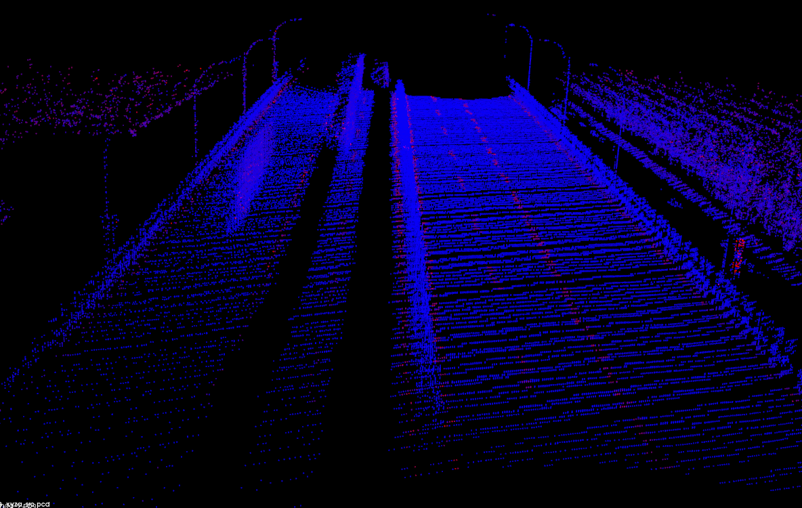
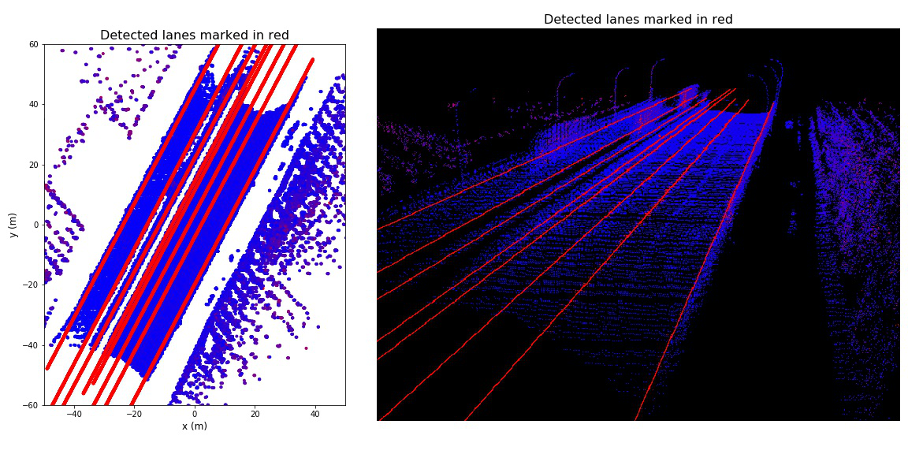

# Detecting Lanes from Point Cloud 


**Figure 1:** Raw point cloud.  
The color represents a point's reflextion intensity: red is 1; blue is 0.

-------------------------



**Figure 2:** Eight lanes are detected from the point cloud and are marked as red lines.
**Left:** 2D view on x-y plane. **Right:** 3D view.  

-------------------------

**Authors:** Feiyu Chen, Zunran Guo  
**Time:** June 5th, 2019   
**Course:**  Geospatial Vision and Visualization  
**Report:** [Report.pdf](Report.pdf), or view it on this [google slide](https://docs.google.com/presentation/d/1qCYxsXetAjxamBPe9fV-3Cld6QCXfZCR1QGav4J_9lM/edit?usp=sharing).  
**Code:** [main.ipynb](main.ipynb)

# Task
Detect lanes from the point cloud of a 80-meter highway road

# Method

To detect the lanes, we observed and made the following assumptions:
1. Lanes are in the road surface. The road is a thin and flat region in point cloud data.
2. Lane points have larger reflection intensity than other road points.
3. The shape of lane is piece-wise straight.
4. Lanes are parrerel to each other

Based on these, we designed the following procedures to detect lanes from the point cloud data:

0. Preprocessing: Change coordinate to Cartesian; Downsample the points while retraining max intensity; Filter out noise points.
1. Remove non-planar regions; Then detect the plane of the road surface by RANSAC.
2. Thresholding on point intensity to get possible lane points.
3. Estimate the direction of lanes by RANSAC.
4. Do clustering to get each lane, and estiamte their 3D line equations.

For more details, please see the report and code.


# Main file
> main.ipynb  

Run through it using jupyter notebook to obtain the lane detection result.

The library functions are in [utils/]().
# Data

* File:  
[data/final_project_point_cloud.fuse](data/final_project_point_cloud.fuse)


* Format:  
Each row uses 4 number to represent a point:
	```
	1. latitude (degree)
	2. longitude (degree)
	3. altitude (meter)
	4. point reflexion intensity (0~100)
	```


# Dependencies
Please use **Python3** and **jupyter notebook** to run the program.  
The command for install the required packages is:  
> $ pip install jupyter numpy scipy sklearn matplotlib open3d-python opencv-python    

Result will be displayed inside the jupyter notebook, as well as saved to the "result/" folder. You could use the "pcl_viewer" to view the saved ".pcd" files. 

To install "pcl_viewer":  
> $ sudo apt-get install pcl-tool